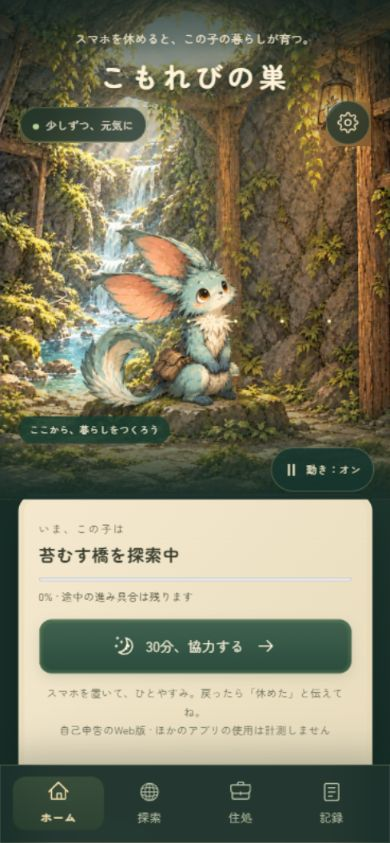
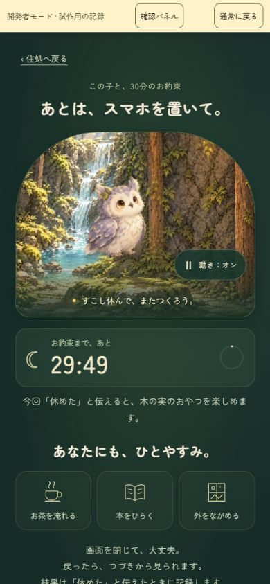
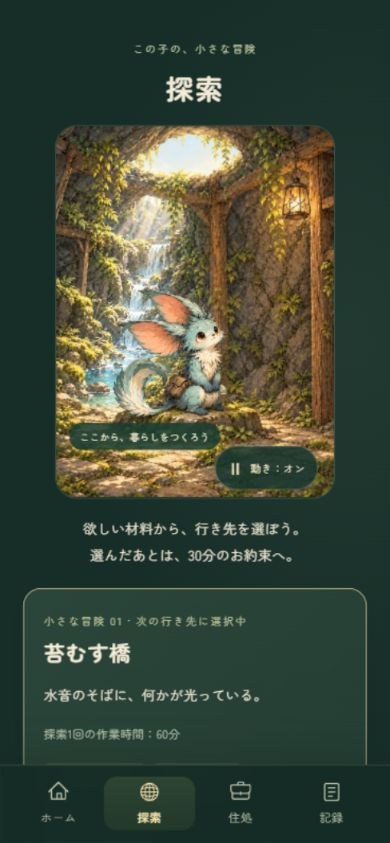
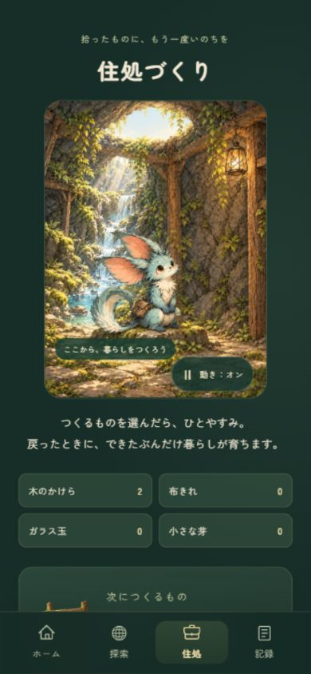
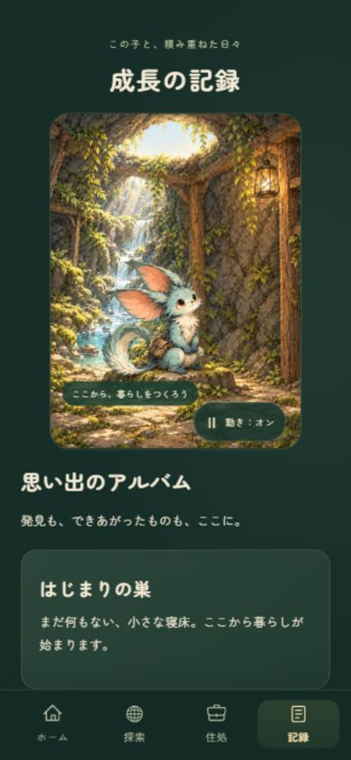
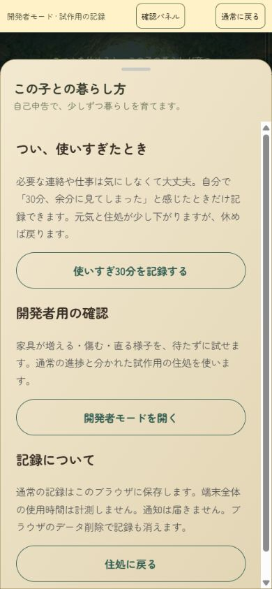
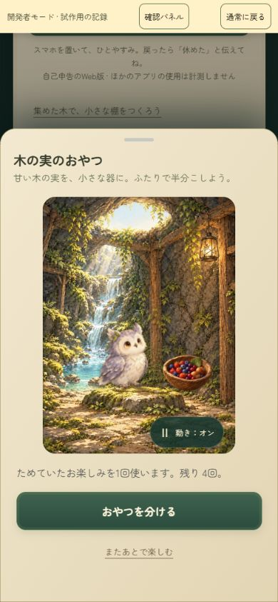
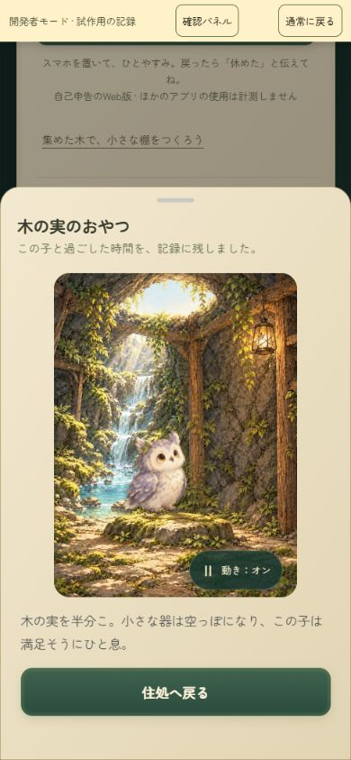
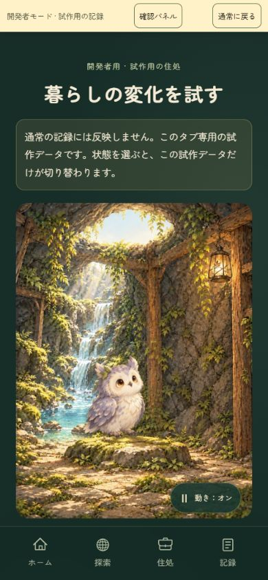

# 画面監査の証拠 — 2026-09-19

[改善メモ・完了状況へ](../../improvement-backlog.md) · [公開アプリ](https://tamago.itisnowornever271.workers.dev/)

対象：main `4a9044b`。Codex内ブラウザの表示設定は390×844（保存された画像は描画の丸めにより390×843）。通常進捗では画面移動のみ。休息開始・食事・キャラ切替は、既存の開発者モードの試作用データで実施した。画像は今回取得した画面をそのまま保存し、保存ファイルを再表示して照合した。端末枠やSafariのアドレスバーを含む実機写真ではない。

評価の「要改善」は見た目だけでなく目的の達成しやすさを指す。全体の世界観、同じ住処・キャラの共有、固定ナビは成立している。色の正確なコントラスト比、読み上げ実機、全画面の拡大表示、通信/電池性能、実際の30分経過、利用者の満足度は本監査では検証していない。文字の小ささ等は観察したリスクであり、WCAG適合性の判定ではない。

## 1. ホーム — 要改善

休息の主ボタンと現在の仕事は見える。自然とキャラを主役にした構図は方向性に合う。一方、初回の棚づくりとイベントは初期表示より下。小さな補助文字に自己申告の条件が載る。TAM-002〜004・009・021。

## 2. 30分の休息開始 — 概ね明快、条件説明は改善余地

「スマホを置いて」とカウントダウンが明快。キャンセルに罰がないことや通知がないことは本文にあるが、下まで読む必要がある。フクロウの足元はこのトリミングでは分かりにくい。今回、本物の30分経過までは待っていない。TAM-003・018〜020。

## 3. 探索 — 要改善

同じ住処が見える安心感はある。ただし上部の縦長画像が大きく、行き先の実行ボタンが画面下へ出る。スクロール後には素材と所要作業時間を確認できる。行き先は2種類。TAM-002・003・012・015・016。

## 4. 住処づくり — 要改善

材料の所持数・不足数と制作見本はある。大きな共通画像と材料欄の後に制作が始まり、390×844では制作ボタンが見えない。模様がえはさらに下にあり、操作結果を上の絵と比較しにくい構成。配置操作の実機使いやすさは追加検証が必要。TAM-002・003・012・013。

## 5. 成長の記録 — 要改善

空の状態でも世界観は続いているが、同じ大きな画像の後に文章が並ぶ。日時や節目の見返しはコード上未実装。100件上限は画像だけでは分からず、保存コードで確認した問題。TAM-006・014・023。

## 6. 設定 — 要改善

使いすぎ申告が自己判断で、仕事等は対象にしなくてよいと説明する点は適切。保存先と通知なしも明記。一方、最初に傷みを加える操作があり、取消手段やバックアップ操作はない。設定の初期フォーカスは今回この申告ボタンに入った。通常進捗への申告は実行していない。TAM-005・007・022・027。

## 7. おやつの招待→実行結果 — 機能は成立、演出は要改善

試作120分の状態でおやつ4回/お茶2回/ピクニック1回を確認。おやつを実行すると4→3回になり、結果文が表示された。閉じる前に保存し、招待を保留できる。見た目は器が消えて文章が変わるだけで、食べる・喜ぶ専用動作はない。残り4回は実行前の所持回数なので、「このあと3回」も併記すると誤解を減らせる。TAM-001・017・020。

## 8. 開発者モード — 機能は成立、操作配置に改善余地

試作用の記録であることが明示され、プリセット・30分進行・追加2体の切替を画面ツリーで確認。フクロウ選択を休息・イベントにも反映できた。大きなプレビューの下に選択肢が続くので、比較は長いスクロールになる。木の実色の子を含む全状態の組合せを今回再検証したわけではない。TAM-020・022・028。

## コードで補足した根拠

- [`Screens.tsx`](../../../src/ui/Screens.tsx)：画面構成、材料導線、日時のない記録表示。
- [`Prototype.tsx`](../../../src/Prototype.tsx)：タブ状態、設定、申告ボタン、開発者モード分離。
- [`QuietTime.tsx`](../../../src/ui/QuietTime.tsx)：30分固定、通知なし、明示確認。
- [`RestEvents.tsx`](../../../src/ui/RestEvents.tsx) / [`rest-events.css`](../../../src/ui/rest-events.css)：招待シートと器の退場演出、共通画像の寸法。
- [`catalog.ts`](../../../src/domain/catalog.ts)：探索2件、制作3件、素材の使い道。
- [`engine.ts`](../../../src/domain/engine.ts) / [`restEvents.ts`](../../../src/domain/restEvents.ts)：100件の記録上限、回復/修繕/制作/探索の順番。
- [`storage.ts`](../../../src/platform/storage.ts) / [`useWorld.ts`](../../../src/application/useWorld.ts)：保存検証、localStorage/sessionStorage、申告の保存。
- [`index.html`](../../../index.html)：英語の言語指定。

画像だけで仕様を断定せず、上記コードと照合した。今回アプリ本体は修正していない。
